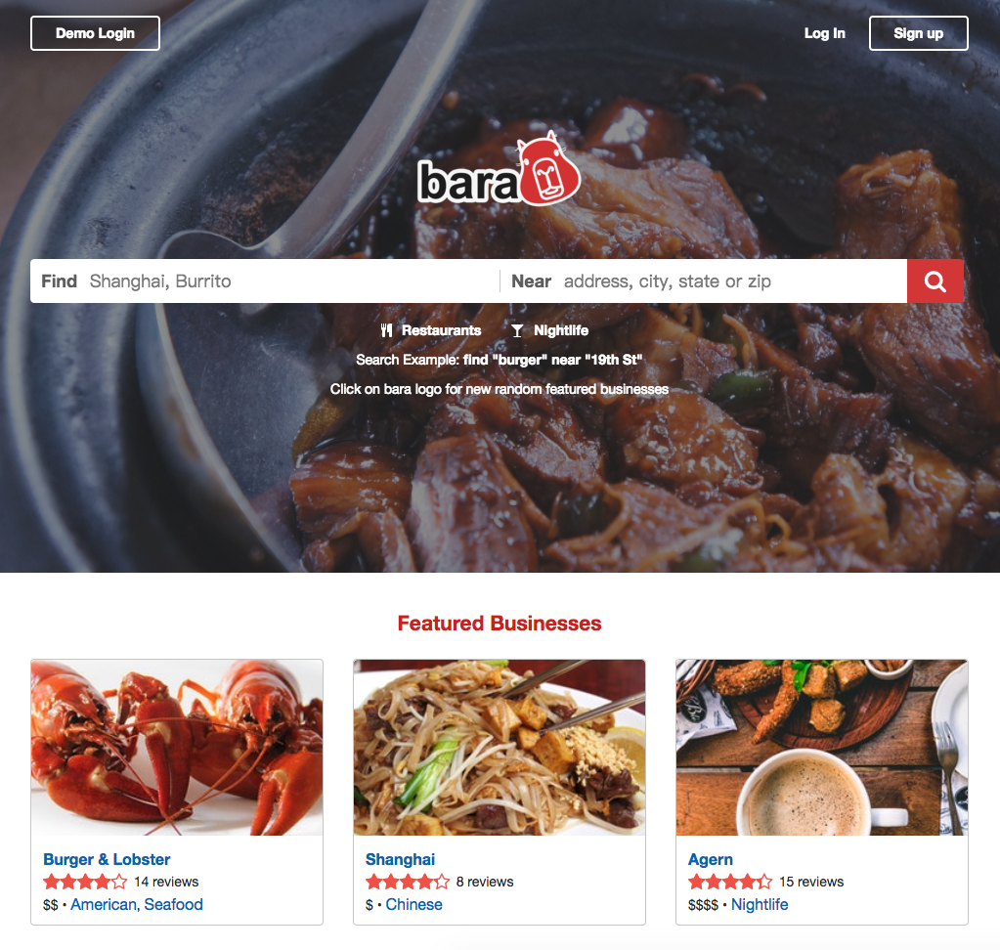
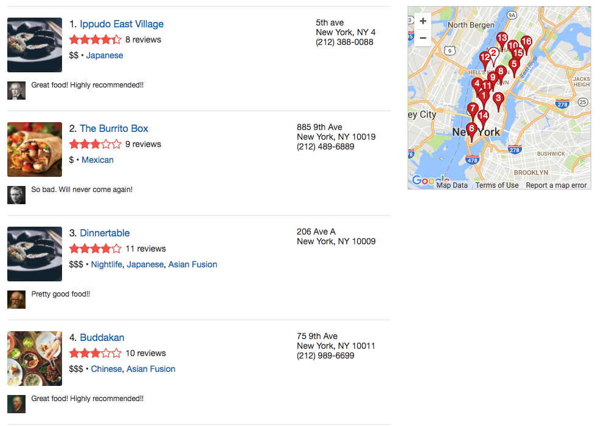

# Bara
[Live](https://bara.davidfeng.us/#/)

Bara is a Yelp-inspired single-page web app where users can CRUD businesses and reviews. It is built with React.js, Redux, Ruby on Rails, and a PostgreSQL database.



## Features
* Each React component loads data from backend (based on URL), not from Redux store, so that the user can directly visit a specific page (a particular business or a business search result), and users can share pages by their URLs.
* Businesses can be searched by its name, address, city, state, zipcode, price range, tags, and their combinations.
* Business show page displays a specific business and its reviews.
* When logged in, a user can create/update/delete businesses and reviews. For demonstration purposes, there are no constraints for operations on businesses, i.e. any user can add businesses and edit/delete any existing businesses. (In reality you probably do not want to allow that!) On the other hand, a user can only review a business once, and only the author is allowed to edit/delete a review.

## Implementation Details
* [Homepage](#homepage)
* [Business search](#business-search)
  * [Search bar](#search-bar)
  * [Sample searches and price filters](#sample-searches-and-price-filters)
  * [Search component](#search-component)
  * [Business tags](#busienss-tags)
  * [Index map](#index-map)

### Homepage
The homepage contains a 'Featured Businesses' section, which displays three random businesses. Clicking on the bara logo updates them. To implements this feature, I added collection route called `feature` and set up corresponding controller and view. Clicking the bara logo sends a GET request to `/api/businesses/feature`, which will send back the information of three random businesses.
```ruby
# config/routes.rb
resources :businesses, only: %i[index show create update destroy] do
  get 'feature', on: :collection
end

# app/controllers/api/businesses_controller.rb
def feature
  @businesses = Business.all.sample(3)
  render 'api/businesses/feature'
end

# app/views/api/businesses/feature.json.jbuilder
json.array! @businesses do |biz|
  json.partial! 'api/businesses/business', business: biz
end
```
The homepage also contains a search bar component, which is the same search bar component in the header of other pages (business search, business show, etc.) See details in the next section.

### Business search

#### Search bar

The search bar has two fields, `name` and `location`, which are filled based on query string (`?name=bur&location=19th`) in the URL (e.g. `https://bara.davidfeng.us/#/businesses/?name=bur&location=19th`) in the `constructor` and `componentWillReceiveProps`. Therefore in a search page, the search bar input fields are filled with those queries.
Upon submission, the search bar pushes `/businesses/?name=${nameEncoded}&location=${locationEncoded}` to the history. Notice that the two fields are encoded using `encodeURIComponent`.

#### Sample searches and price filters

Sample searches provides some links for the user to try the search functionality.
The price filters fetches all the current filters (`name`, `location`, `tag`, current `prices[]`) from the URL, and adds/removes a specific `prices[]` value when the user clicks on the dollar sign buttons. The updated search result will show up after the click. No need to click the submit button. Also, it is possible to select multiple `prices[]` values (e.g. "$" and "$$$$", which translates to `prices[]=1&prices[]=4` in the query string).

#### Search component

The search component first set the `loaded` field in its state to be `false`, which displays the loading spinner. Then it get all the filters (`name`, `location`, `tag`, `prices[]`) from the URL, send them to the backend, and the business index route handles the search and sends back the information of matched businesses (see below). Then the search component displays those businesses.
```ruby
def index
  businesses = Business.all.includes(:reviews, :tags)

  # search by the tag
  if params[:tag] && Tag.find_by(label: params[:tag].split.map(&:capitalize).join(' '))
    businesses = Tag.find_by(label: params[:tag].split.map(&:capitalize).join(' ')).businesses
  end

  # search by the name
  if params[:name] && params[:name] != ''
    businesses =
      businesses.where('lower(name) LIKE ?', "%#{params[:name].downcase}%")
  end

  # search by the location
  if params[:location] && params[:location] != ''
    businesses =
      businesses.where('lower(address) LIKE ?', "%#{params[:location].downcase}%")
                .or(businesses.where('lower(city) LIKE ?', "%#{params[:location].downcase}%"))
                .or(businesses.where('lower(state) LIKE ?', "%#{params[:location].downcase}%"))
                .or(businesses.where('zipcode = ?', params[:location].to_i))
  end

  # search by the prices
  if params[:prices] && params[:prices] != ''
    prices_numbers = params[:prices].map(&:to_i)
    businesses = businesses.where(price: prices_numbers)
  end

  # include the latest review, which is shown on the search page
  @businesses = businesses.includes(latest_reviews: [:author]).order(updated_at: :desc)
  render 'api/businesses/index'
end
```

#### Business tags
Businesses and tags (e.g. 'Chinese', 'Japanese', 'Nightlife') have a many-to-many relationship. Thus the database has a `taggings` joint table to handle it. In the search result entries, the tag links of each business are shown next to its price range (dollar sign). Click on the tag link would fire a new search to fetch all the businesses with that tag.

#### Index map
The index map is wrapped in a div, which has a 'sticky' CSS position property, so that when scrolling down the page, the map is always on the page.
When a business index entry is hovered, the business is 'highlighted', and the corresponding icon on the map should change to a different style. Instead of passing the highlighted business' id and the `highlightBusiness` action amongst all the relavant components, Redux is used to store the highlight. See the graph below for details.
```
SearchContainer
│ (map highlightBusiness action to props)
│
Search
│ (change the highlight to -1 before unmounting)
│
└───BusinessIndex
│   │
│   └───BusinessIndexItemContainer
│       │ (map highlightBusiness action to props)
│       │
│       BusinessIndexItem
│         (change the highlight to the business.id onMouseEnter,
│          change it to -1 onMouseLeave)
│
└───IndexMapContainer
    │ (map highlight in Redux store to props)
    │
    IndexMap
      (change the style of highlighted business icon)
```

### Business show

The path for the business show page is '/businesses/:id'. After the component mounts, it fetches business and its reviews from the backend.
### Forms
General pattern: authroute, etc.
Note that business form and review form are rendered by `ProtectedRoute`, which means the user needes to log in to view these components. The session form is rendered by `AuthRoute`, which can only be viewed if no user is logged in.

#### Session form
Session form is rendered
Two React routes lead
talk about user avatar
#### Business form
talk about business image
#### Review form

### 1. Overview
#### React router (frontend)
```javascript
<Switch>
  // Business form: create a business
  <ProtectedRoute path="/businesses/new"
    component={BusinessFormContainer} />
  // Business form: edit a business
  <ProtectedRoute path="/businesses/:id/edit"
    component={BusinessFormContainer} />
  // Review form: create a review
  <ProtectedRoute path="/businesses/:business_id/reviews/new"
    component={ReviewFormContainer} />
  // Review form: create a review
  <ProtectedRoute path="/reviews/:id/edit"
    component={ReviewFormContainer} />
  // Session form: create a session (log in)
  <AuthRoute path="/login" component={SessionFormContainer} />
  // Session form: create a user (sign up)
  <AuthRoute path="/signup" component={SessionFormContainer} />
  // Business show page
  <Route path='/businesses/:id' component={BusinessShowContainer} />
  // Business search page
  <Route path='/businesses' component={SearchContainer} />
  // Homepage
  <Route exact path='/' component={Home} />
  // 404 page
  <Route component={FourZeroFour} />
</Switch>
```
### Misc
404?

## Possible Future Directions

### Better business search
More filter options (e.g. filter by average rating) and more ways to sort search results (e.g. by created/updated time, average rating, number of reviews, price, etc.)

### Reviews tags and sorting
On the business show page, reviews can be tagged (e.g. funny, cool, useful etc.) and sorted in different ways (e.g. by number of useful tags).

### User profile
The user profile page allows the user to change avatar, shows all the activities of the user (e.g. posting reviews), and all the content created by the user.

### Favorite businesses
A user should be able to store a business to a favorite list. The user might be able to create other lists.

### Friends
Users can be friend with other users, and a news feed can be generated from the activities of friends.


--- old draft below ---
### 1. User creation and authentication
When a user is created, on the back-end, passwords are hashed by bcrypt and the resulting hash is stored in the database.
If there is an error in the user creation (e.g. username has been taken), the backend will send the error messages to the front-end, which will be rendered in an ErrorList React component. The errors can be dismissed.
If the user is created successfully, it will be assigned to a default avatar (handled by Amazon Web Services and Paperclip gem).
After logging in, the avatar appears on the top right, which reveals a drop-down box containing more user information upon clicking.

If no user is logged in, attempts to create/edit businesses/reviews will be redirected to the login page. The browser goes back to the previous page after logging in.

### 2. Business index page, map, price filter
The business index page contains basic information of each business. The average rating and the latest review will be updated after a new review is posted.
On the business index page, the user can filter the businesses by the price range. After the filter changes, the index entries and the markers on the map will update accordingly. Filters can be reset.

### 3. Business show page
Business show page contains details, a map, an edit link, and reviews for a business. Reviews are ordered reversely by their creation time.

### 4. Business form
When a business is created, Bara sends the full address (combines the `address`, `city`, `state` columns in the `businesses` table) to the Google Maps Geocoding API, which returns the latitude and longitude. The `lat` and `lng` columns are then updated. The coordinates are then used to set up the center of the map and to place a marker on it.
